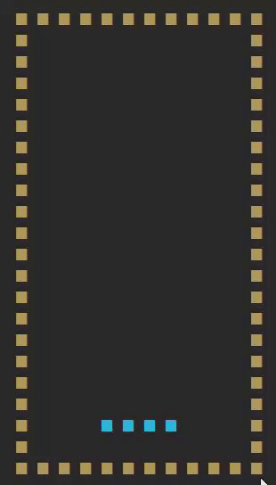

# Rubyでテトリスを実装する

[WSL2上にRuby開発環境を構築してテトリスを作ってみた #Ruby - Qiita](https://qiita.com/flee_rife/items/c4bc3ff007a9af4f2625)を参考にして、Rubyでテトリスを実装してみました。

## 実行方法

```bash
$ ruby tetoris.rb
```



## 操作方法

- 左右キー: ブロックを左右に移動
- 上キー: ブロックを回転
- 下キー: ブロックを下に移動
- Qキー: 終了
- Rキー: リセット(ゲームオーバー時のみ)
